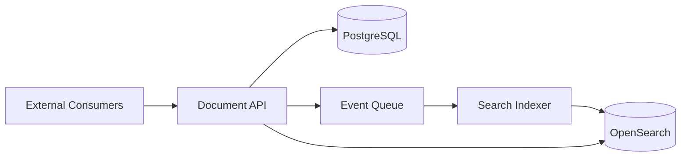

# ADR 001: Document Storage and Search Design

## Status

Proposed

## Context

Part 3 asks how the system would store redacted documents and make them searchable by the keywords that were redacted from them. The implementation is intentionally out of scope, but the design should support external consumers, auditability, and future production hardening.

## Decision

Use an API-backed document service with durable relational storage for document metadata and redaction events, plus a search index optimized for keyword lookup.

## Storage Model

- Store canonical document records in PostgreSQL.
- Store redacted text separately from restoration material.
- Store redaction events with document id, normalized redacted term, original term, position, timestamp, and actor metadata.
- Store unredaction keys or restoration payloads in a protected secrets boundary, not in the searchable index.

Candidate tables:

- `documents`: id, title, redacted_text, created_at, updated_at, classification, owner_id.
- `document_redactions`: id, document_id, term_hash, normalized_term, original_value_ref, start_offset, end_offset.
- `document_audit_events`: id, document_id, actor_id, action, created_at, metadata.

## Search Design

- Index redacted terms and document metadata into OpenSearch.
- Normalize search terms consistently at write and query time.
- Support exact keyword search first; add phrase/full-text search as a later capability if needed.
- Use the search index only for discovery, then fetch canonical document data from PostgreSQL by document id.

## External API

- `POST /documents/redactions`: redact and store a document.
- `GET /documents/{id}`: retrieve a stored redacted document.
- `GET /documents?redactedTerm=...`: search by redacted keyword or phrase.
- `POST /documents/{id}/unredactions`: restore with a provided key when caller is authorized.

All endpoints should require authentication, authorization, request validation, rate limits, and audit logging.

## Security and Trade-offs

- The exercise key is not cryptographic; production should use envelope encryption and KMS-managed keys.
- Searchability and secrecy are in tension. Index only the minimum necessary normalized terms, and consider hashing terms if exact-match search is sufficient.
- Event-driven indexing makes writes resilient and scalable, but introduces eventual consistency.
- PostgreSQL can support a small-scale version with indexes or `tsvector`; OpenSearch is preferable once query volume, ranking, or operational search features matter.
